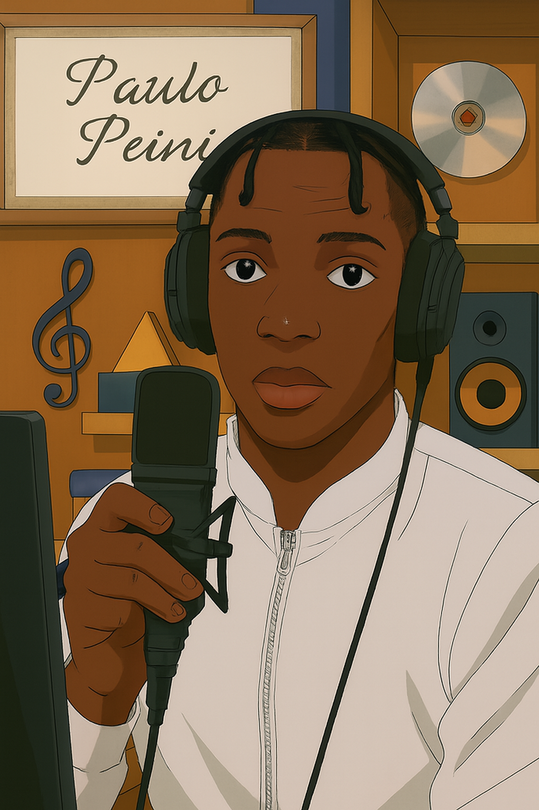

# 🎧 Projeto Podcast — Quem é Paulo João

ℹ️ **NOTA:** Este é um projeto pessoal desenvolvido por **Paulo João Dongosse**, inspirado na ideia de unir ferramentas de Inteligência Artificial para criar um podcast completo — do roteiro à capa, à voz e ao vídeo final.

O objetivo deste projeto é demonstrar como a IA pode ser usada de forma criativa e integrada em todas as etapas do processo de produção de um conteúdo multimídia.

---

## 💻 Tecnologias utilizadas no projeto

- **ChatGPT** → geração e refinamento do roteiro  
- **ElevenLabs** → geração da narração em áudio  
- **Midjourney** → criação da capa do podcast  
- **CapCut** → tratamento de áudio e adição de sons de fundo  
- **Studio D-ID** → criação e animação do apresentador virtual em vídeo  

---

## ✨ Como foi feito?

1. **Roteiro** elaborado com o ChatGPT, baseado na trajetória acadêmica e profissional de Paulo João.  
2. **Narração em áudio** produzida com a ElevenLabs.  
3. **Capa visual** gerada com o Midjourney.  
4. **Edição de som e montagem** realizadas no CapCut, com trilha sonora e efeitos.  
5. **Geração do vídeo** feita com o **Studio D-ID**, transformando o áudio e o roteiro em uma apresentação visual realista.  

---

## 📚 Materiais

- 🎧 **Áudio final:** [link_para_o_audio.mp3](#) *(adicione aqui quando publicar)*  
- 🖼️ **Capa do podcast:** incluída acima (`my3.png`)  
- 💬 **Roteiro completo:** [`roteiro_podcast.md`](./roteiro_podcast.txt)  
- 🎬 **Vídeo de apresentação:** [`video_podcast.mp4`](./video_podcast.mp4)

---

## 🎬 Vídeo de Apresentação

Este vídeo faz parte integrante do projeto e apresenta uma versão animada do podcast, criada com o **Studio D-ID**.  
A tecnologia foi usada para dar vida à narração, combinando voz sintética, imagem e movimento, resultando em uma experiência audiovisual mais imersiva.

📹 **Assista ao vídeo abaixo:**

[▶️ Abrir vídeo de apresentação](./video_podcast.mp4)

---

## 🛠️ Instruções para criar seu próprio podcast com IA

1. 🤖 Gere o **roteiro** no **ChatGPT**, com prompts bem detalhados.  
2. 🎙️ Converta o texto em **áudio** com a **ElevenLabs**.  
3. 🎨 Crie a **arte da capa** com o **Midjourney**.  
4. 🎧 Edite o áudio e adicione trilhas no **CapCut**.  
5. 🎞️ Gere o **vídeo com avatar animado** no **Studio D-ID**.  

---

## 👨‍💻 Autor

**Paulo João Dongosse**  
Estudante do 5º semestre de **Ciências da Computação** e **Análise e Desenvolvimento de Sistemas**, com foco em **dados** e **desenvolvimento de software**.

📎 [GitHub](https://github.com/SeuUsuarioGitHub) | [LinkedIn](https://linkedin.com/in/seu-linkedin) | [E-mail](mailto:seuemail@exemplo.com)

---

⌨️ com 💜 por **Paulo João Dongosse**
